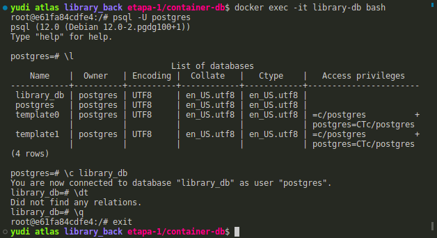
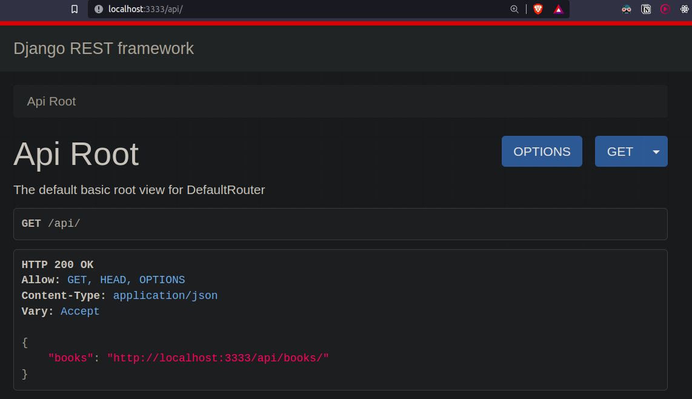
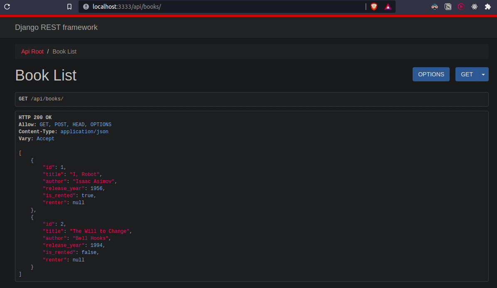
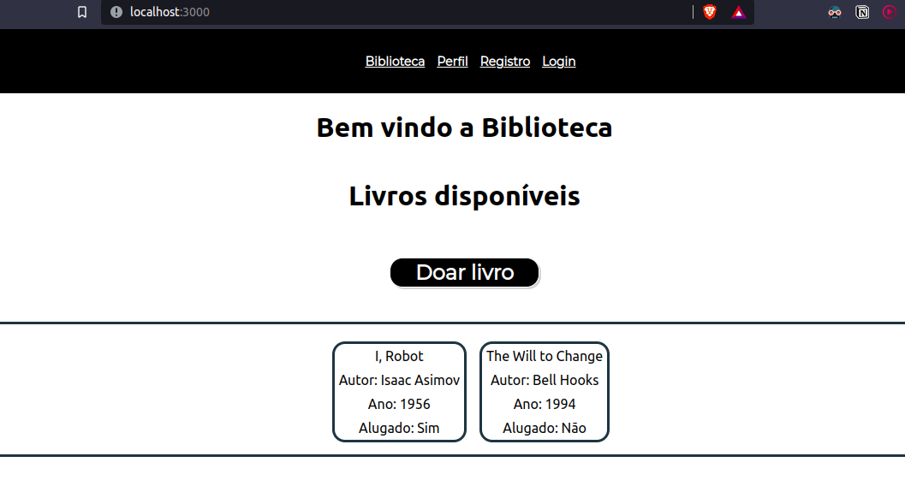
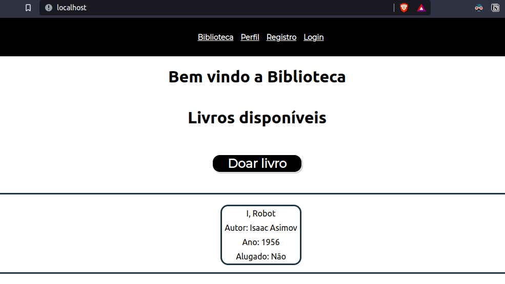

# Notas de desenvolvimento

Minha estratégia geral para documentação é dividida em duas partes

**Notas de desenvolvimento**: esse arquivo que você está lendo agora. Nele, vou
escrever brevemente sobre o meu processo para completar as etapas e as 
dificuldades encontradas no meio do caminho.

**Commits semânticos**: (ou conventional commits na gringa). Commits semânticos
é uma convenção adotada para mensagens de commit que consiste realizar mudanças
atômicas em cada commit, com uma mensagem curta e clara sobre a mudança. Leia
mais sobre isso [aqui](https://conventionalcommits.org/).


## Etapa 1 - Containerização do banco de dados

Contexto: `library_back`

Para esta etapa, o container do banco de dados foi declarado e levantado pelo
docker compose. As variáveis de ambiente são importadas do arquivo `.env` (apenas 
uma cópia do `.env-sample`).

A seguir, você pode ver um screenshot do banco de dados sendo
consultando _dentro_ do container `library-db`.




## Etapa 2 - Container do app + banco

Contexto: `library_back`

Mudanças no serviço `library-db`:

- conecta container do banco à rede `library-network`
- declara volume do banco com nome `library-pg-data`

Como vários comandos precisam ser executados para preparar a API, foi decidido
colocar esses comandos no script `scripts/start.sh`. Esse script é executado como
comando default no `docker-compose.yml` para executar as migrações e iniciar o servidor.

O banco de dados parece estar sendo
preenchido com as tabelas corretamente:


A API é iniciada, mas não consiguia acessar pelo navegador. Então mudei o comando de iniciar o servidor no script `start.sh` para o seguinte

```sh
python manage.py runserver 0.0.0.0:3333
```

Assim, foi possível acessar a interface do Django:



E os livros podem ser criados no banco de dados e visualizados no navegador:



Em seguida, removi as variáveis ambiente hardcoded no `start.sh` 

    echo ">>> starting server"
    python manage.py runserver "0.0.0.0:${API_PORT}"

E no `docker-compose.yml`:

    image: "postgres:${POSTGRES_VERSION}"
    ...
    ports:
      - "${API_PORT}:${API_PORT}"

Assim, as variáveis ambiente (portas até agora) ficam concentradas em apenas
um local, `.env`, o que facilita a manutenção.

Melhorias: 

<!-- TODO: fazer essas melhorias aqui -->
- a imagem do Python geralmente é maior do que se necessita para uma aplicação.
Acredito que há oportunidade de otimização (uma ferramenta útil: 
[dive](https://github.com/wagoodman/dive))
<!-- TODO: fazer essas melhorias aqui -->
- tempo de construção da imagem >3min
<!-- TODO: fazer essas melhorias aqui -->
- dá pra cachear as dependências do Python?


Dúvidas:

- no arquivo `.env` eu tive que mudar `POSTGRES_HOST` de `127.0.0.1` 
para `library-db`. Por que? O container não conhece a rede local?
- no final

## Etapa 3 - Container do frontend

Contexto: `library_front`

Na etapa 3, vai estar implícito que os containeres do back estão rodando.

Para o app React comunicar com a API, foi feita a seguinte modificação:

```diff
export const BASE_API = axios.create({
-   baseURL: "http://localhost:8000"
+   baseURL: "http://localhost:3333"
});
```

Depois de executar `docker compose up --build` era possível ver o 
seguinte:



Você pode notar que são os mesmos livros que apareceram na etapa 2, mas
agora são apresentados pelo frontend.

Melhorias:

- cachear `node_modules`

--- 

**Pode fazer em dois repos separados? Back e front.**?

Nginx só pro front ou back? ou pros dois?

---

## Etapa 4 - Container Nginx

Depois de tirar dúvidas com o professor, decidi ter apenas um `docker-compose.yml`
na raíz do projeto que levanta todos os containeres.

O container do Nginx redireciona o tráfego na porta 80 (servidor nginx) para a 
porta 3000 (aplicação web React). Na imagem a seguir, é possível observar que 
a requisição é feita pela porta padrão 80 e o resultado é a primeira página
da biblioteca:




Dúvidas pairando na minha cabeça:

- em produção, o que deve rodar são as builds do frontend e do backend. Com os
Dockerfiles atuais, o que estão rodando são as versões de desenvolvimento. Como
usar uma imagem de build de produção em ambiente de produção? Tem que fazer um 
Dockerfile novo de produção? (Esse me parece muito repetitivo)
<!-- https://devcenter.heroku.com/articles/local-development-with-docker-compose -->