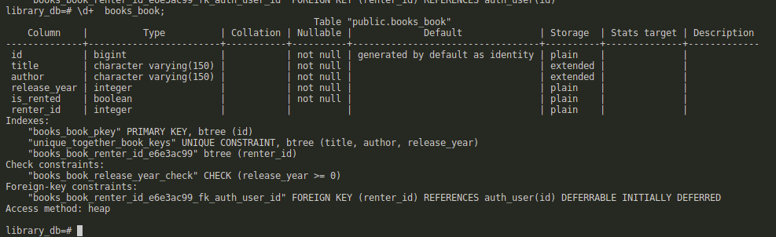

# Notas de desenvolvimento

Minha estratégia geral para documentação é dividida em duas partes

**Notas de desenvolvimento**: esse arquivo que você está lendo agora. Nele, vou
escrever brevemente sobre o meu processo para completar as etapas e as 
dificuldades encontradas no meio do caminho.

**Commits semânticos**: (ou conventional commits na gringa). Commits semânticos
é uma convenção adotada para mensagens de commit que consiste realizar mudanças
atômicas em cada commit, com uma mensagem curta e clara sobre a mudança. Leia
mais sobre isso [aqui](https://conventionalcommits.org/).


## Etapa 1 - Containerização do banco de dados

Contexto: `library_back`

Para esta etapa, o container do banco de dados foi declarado e levantado pelo
docker compose. As variáveis de ambiente são importadas do arquivo `.env` (apenas 
uma cópia do `.env-sample`).

A seguir, você pode ver um screenshot do banco de dados sendo
consultando _dentro_ do container `library-db`.


## Etapa 2 - Container do app + banco

Contexto: `library_back`

Mudanças no serviço `library-db`:

- conecta container do banco à rede `library-network`
- declara volume do banco com nome `library-pg-data`

Como vários comandos precisam ser executados para preparar a API, foi decidido
colocar esses comandos no script `scripts/start.sh`. Esse script é executado como
comando default no `docker-compose.yml` para executar as migrações e iniciar o servidor.

O banco de dados parece estar sendo
preenchido com as tabelas corretamente:



A API é iniciada, mas não consiguia acessar pelo navegador. Então mudei o comando de iniciar o servidor no script `start.sh` para o seguinte

```sh
python manage.py runserver 0.0.0.0:3333
```

Assim, foi possível acessar a interface do Django:


Em seguida, removi as variáveis ambiente hardcoded no `start.sh` 

    echo ">>> starting server"
    python manage.py runserver "0.0.0.0:${API_PORT}"

E no `docker-compose.yml`:

    ports:
      - "${API_PORT}:${API_PORT}"

Assim, as variáveis ambiente (portas até agora) ficam concentradas em apenas
um local, `.env`, o que facilita a manutenção.

Melhorias: 

<!-- TODO: fazer essas melhorias aqui -->
- a imagem do Python geralmente é maior do que se necessita para uma aplicação.
Acredito que há oportunidade de otimização (uma ferramenta útil: 
[dive](https://github.com/wagoodman/dive))
<!-- TODO: fazer essas melhorias aqui -->
- tempo de construção da imagem >3min
<!-- TODO: fazer essas melhorias aqui -->
- dá pra cachear as dependências do Python?


Dúvidas:

- no arquivo `.env` eu tive que mudar `POSTGRES_HOST` de `127.0.0.1` 
para `library-db`. Por que? O container não conhece a rede local?
- no final

